# :partly_sunny: 몽글몽글 :cloud:

---------------------------

> 내 감정이 기록되는 감정 분석 일기장

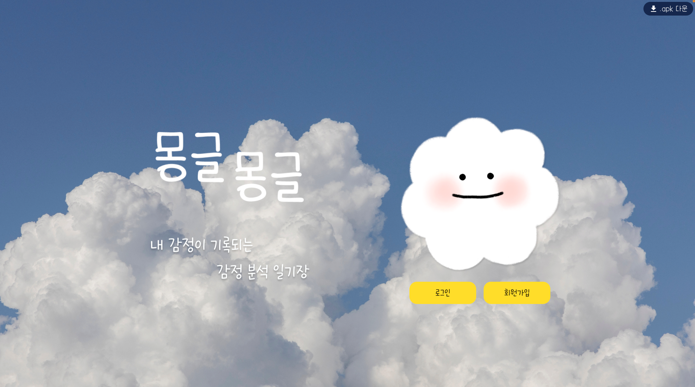

## 🚀프로젝트 소개

 사용자들이 일상을 기록하여 하루하루 의미를 부여하고, 사용자의 감정을 분석하여 그에 맞는 추천음악을 제공하는 힐링 서비스 “나만의 감정 일기장” **몽글몽글**

 

### 📆진행 일정

22.08.22(월) ~ 22.10.07(금) (총 6주)

 

### 🤝우리팀 :cupid:

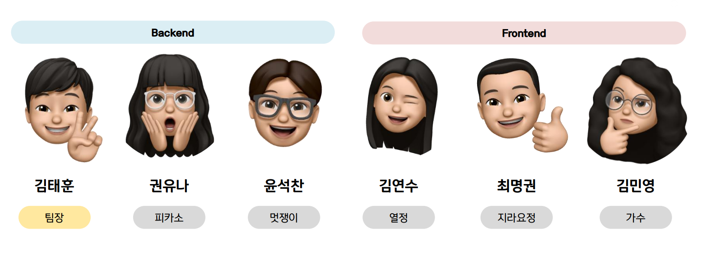

### 📅WBS

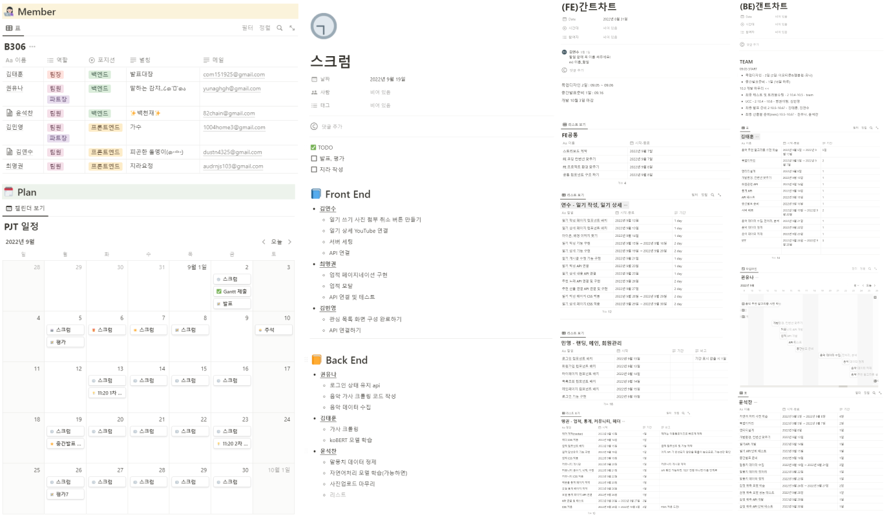

- Sub pjt1 - 기획(08.22 ~ 09.02) 
  
  - 프로젝트 아이디어 도출, 주제 구체화, 기능 요구 명세서 작성

- Sub pjt2 - 설계 (08.22 ~ 09.12)
  
  - 와이어프레임, 프로젝트 구조, 사용 기술 스택 선정

- Sub pjt3 - 개발 (08.22~10.07) 
  
  - 기능 구현, 배포, 통합 테스트, UCC, 발표

 

### 🏁목표

- 프로젝트 일정을 Jira와 ganttchart를 이용하고 체계적으로 관리하여 주어진 업무를 효율적으로 마무리하는 것을 제일의 목표로 하자!
- 빅데이터, AI 등 필요한 기술 스텍을 철저히 공부해서 완벽하게 구현하자!
- PWA 환경을 구축해 언제 어디서나 어떤 디바이스로 접속하도록 하자!
- 팀원 모두 역할을 균등 분배하여 “나만의 감정 일기장” **몽글몽글** 을 완성하자!

 

### :thought_balloon: 기획 의도

- 전염병의 장기화로 인한 우을 증세 보이는 환자가 증가하고있다.

- 특히 20대의 경우, 취업난으로 인해 마음의 병을 앓는 사람이 많아지고 있다.

- 일기를 작성하고 자신의 감정을 파악하는 것은 삶을 점검하고 긍정적인 마음을 통해 자존감 회복에 도움을 준다.

- 따라서 심리 건강을 위해서도 일기를 쓰고 감정을 파악하는 것은 중요하며, 이에 대한 사회적 관심 또한 많아지고 있다.

- 누구나 일기를 통해 소소한 일상에 의미를 부여하고 하루를 마무리 할 수 있는 힐링 서비스 기획.

- 사용자들은 오늘 하루에 대한 일기를 작성. 작성된 일기를 분석하여 감정을 도출하고, 정서에 도움이 되는 음악과 나에게 주는 선물을 추천해주는 서비스를 제공하는 것이 목표.

 

### :point_right: 페르소나 :raising_hand:

> 서비스 타겟

 

### ⚙ Technical

1. 이슈관리 : Jira, ganttchart

2. 형상관리 : Gitlab

3. 커뮤니케이션 : MatterMost, Notion

4. 디자인 : Figma, Adobe Photoshop

5. 개발환경
   
   1. OS : Windows 10
   
   2. IDE
      
      1. IntelliJ IDEA 2022.2
      
      2. Visual Studio Code 1.70.0
   
   3. Database : MySQL Workbench
      8.0.30
   
   4. Server : AWS EC2 (MobaXturm)
      
      1. Ubuntu 20.04 LTS
      
      2. Docker 20.10.17

 

### 🖼프론트엔드

1. HTML5, CSS3, JavaScript(ES6)

2. vue 3.2.13

3. vuex 4.0.2

4. axios 0.27.2

5. vue-router 4.1.2

6. vuetify

 

### 📡백엔드

1. Java (zulu jdk 1.8)

2. gradle-7.5-bin

3. Lombok, jpa, swagger, starter-mail, jwt

4. Fast API

 

### :triangular_ruler: 아키텍처

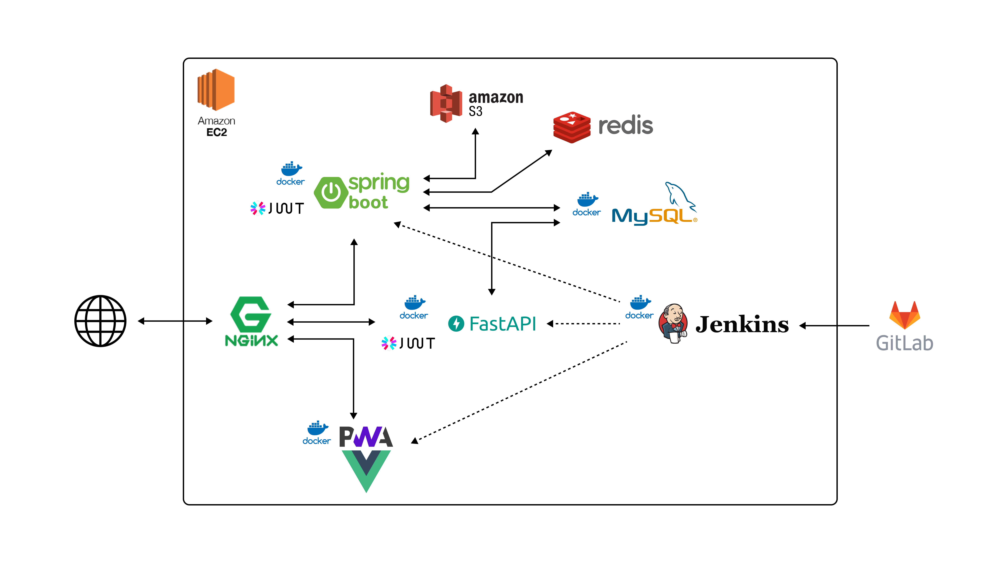

#### :stuck_out_tongue_winking_eye: 감정분석

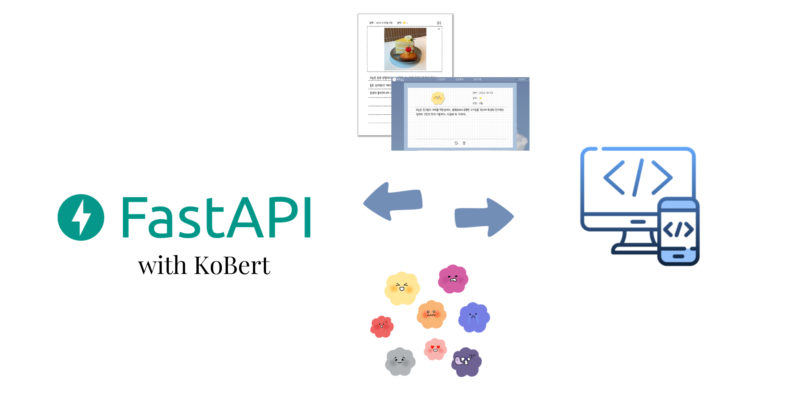

일기 작성 후, 서버로 전달

- *koBert(Fast API)를 파인튜닝한 감정 분류모델로 감정 분류
  
  - koBert : 구글에서 개발, 자연어처리 분야에서 뛰어난 성능을 보여주는 bert 모델을 한국어 기반으로 제작한 자연어처리 모델

- *10가지의 감정 모델 추출
  
  - AI 허브의 감성대화 말뭉치 데이터셋을 10가지 감정으로 재분류하여 약 20000개의 문장을 학습 데이터로 활용

 

#### :musical_score: 음악추천

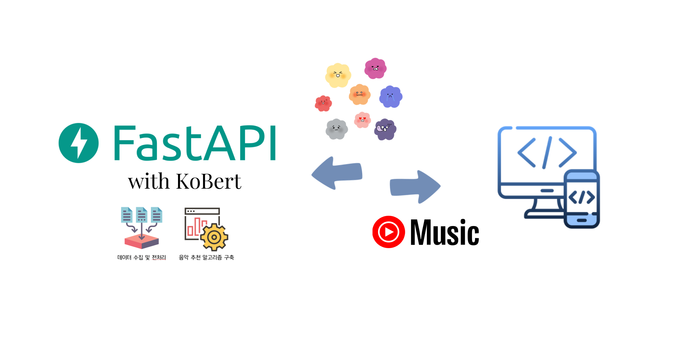

10000개의 음악데이터 수집

- 동일한 koBert(Fast API) 감정 분류모델로 가사 분석, 감정값 도출(저장)

- 코사인 유사도 측정을 이용, 10개의 감정값을 다차원으로 측정

- 일기와 가장 유사한 음악을 추천

 

### :bookmark_tabs: ERD

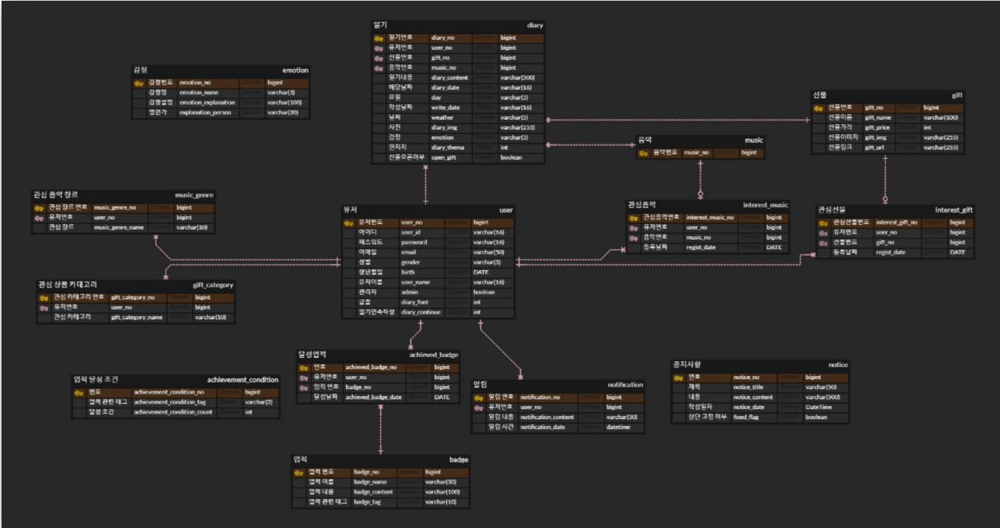

[프로젝트 종료로 접근이 불가능합니다.]()

 

### :newspaper: 기능명세서

- 페이지별로 기능을 구체화하여 유저 스토리를 토대로 기능을 작성하고 기능 세부사항과 조건, 특이사항, 구현 우선순위를 지정
  
  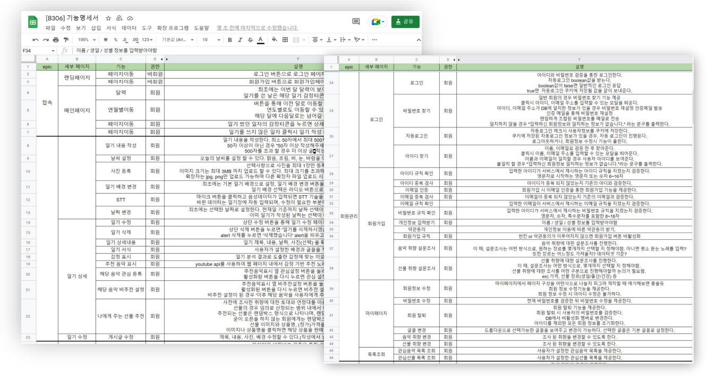

[프로젝트 종료로 접근이 불가능합니다.]() 

 

### :books: API 문서

- 기능명세서를 토대로 맡은 역할 별로 의논하고 팀원끼리 교차검증하여 작성
  
  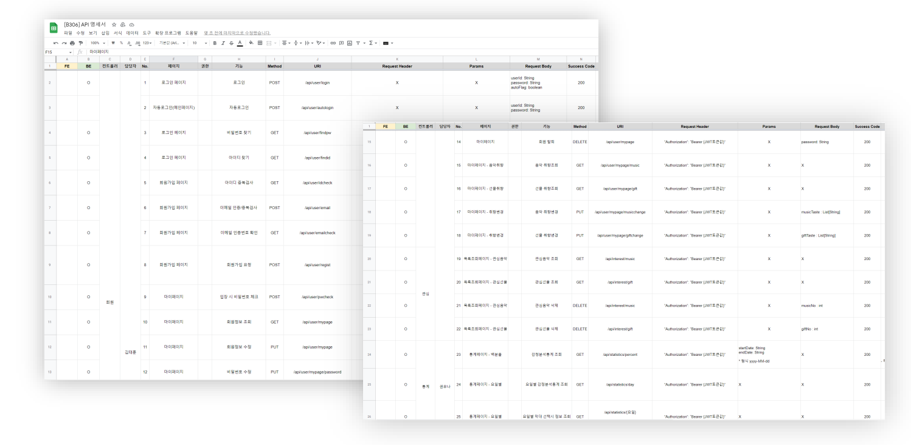

[프로젝트 종료로 접근이 불가능합니다.]()

 

### :eyes: 프로토타입

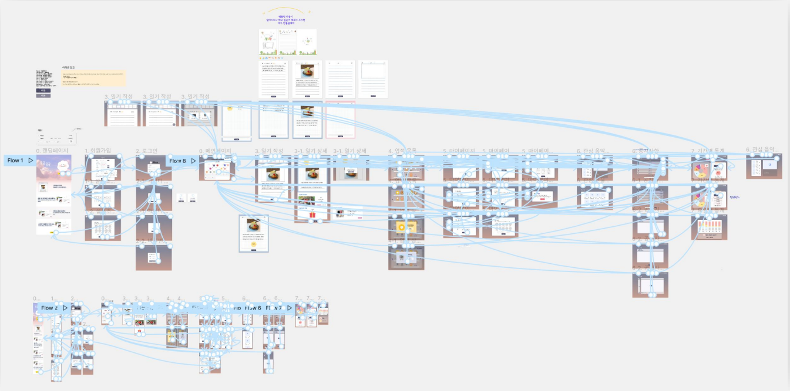

[프로젝트 종료로 접근이 불가능합니다.]()

 

### :chart_with_upwards_trend: 프로젝트 디렉토리

| Back                              | Back                            | Front                             | Front                                |
| --------------------------------- | ------------------------------- | --------------------------------- | ------------------------------------ |
| Sprint                            | Fast API                        | Vue2 asset                        | Vue2 component                       |
| 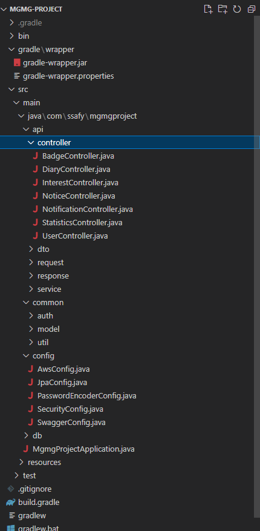 | 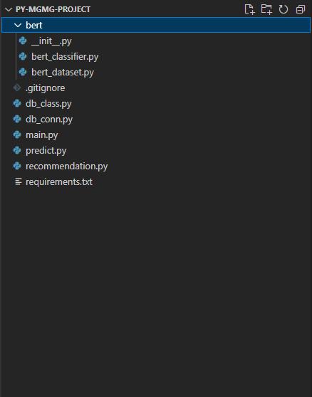 | 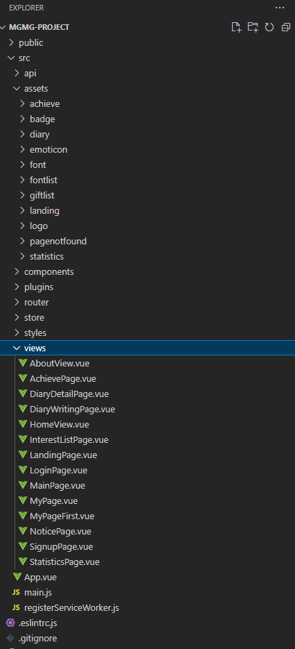 | 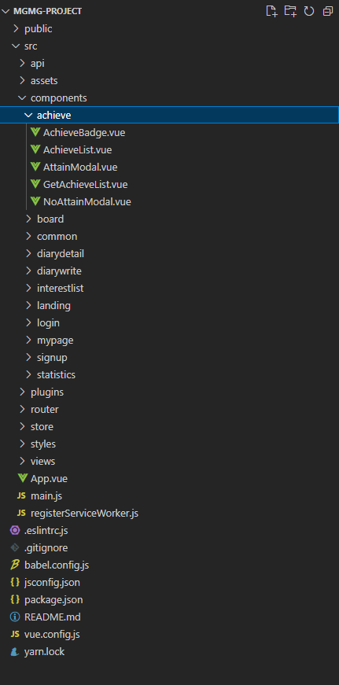 |

### 📬배포 방법

> [포팅메뉴얼](./exec/프로젝트 포팅 매뉴얼.doc)

- word(.doc) 파일

 

### :notebook_with_decorative_cover:시연시나리오

> [시연시나리오](./exec/시연시나리오.docx)

- word(docx) 파일 

 

## :art: 핵심 페이지(with PWA)

 

#### :heavy_check_mark: 메인 페이지

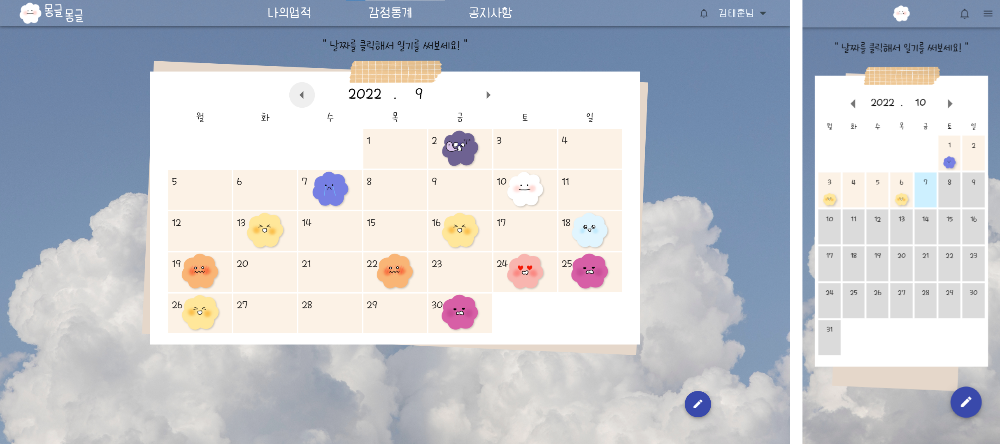

기존의 작성된 일기를 확인 가능

- 작성된 일들은 일기의 감정에 따라 다양한 이모티콘으로 달력에 표시

- 달력의 날짜를 자유롭게 이동

 

#### :heavy_check_mark: 일기쓰기 페이지

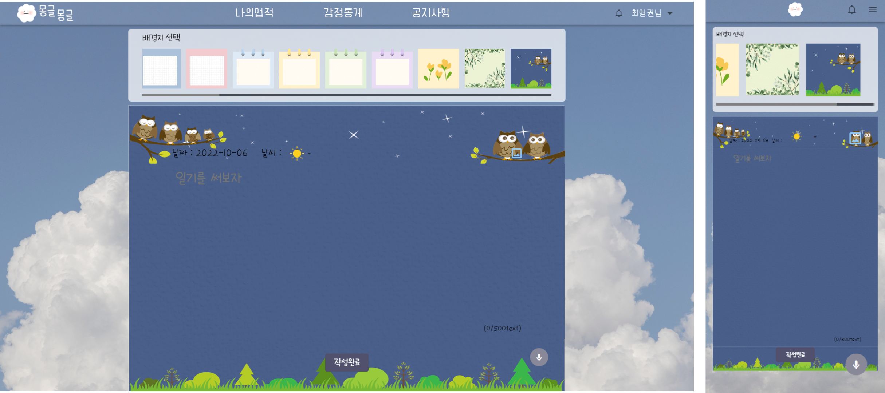

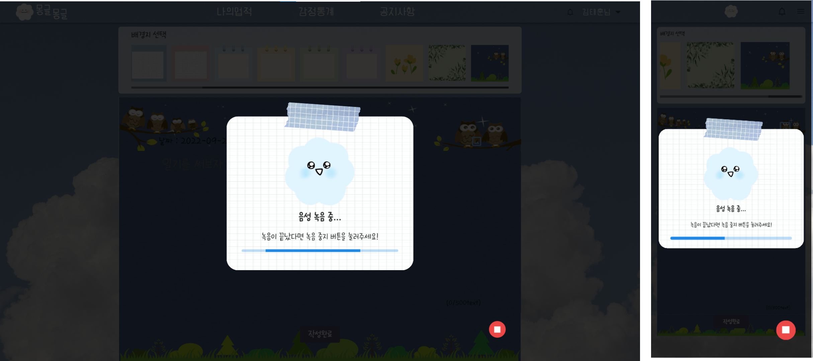

원하는 편지지에 맞춰 일기 작성

- 이미지나 사진 업로드 가능

- STT 지원으로 음성으로 일기 작성

 

#### :heavy_check_mark: 일기 상세(분석) 페이지

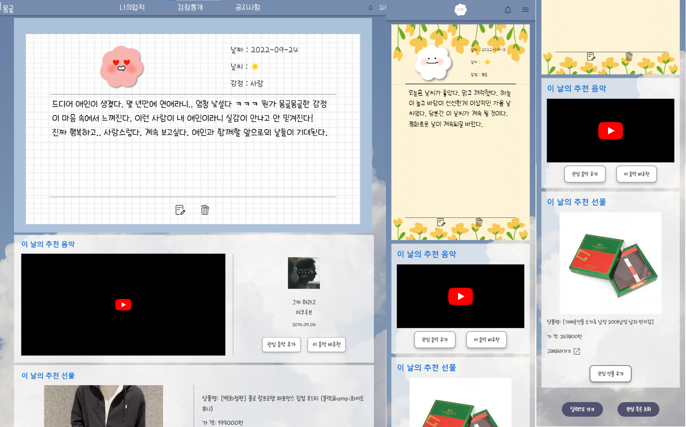

일기 작성 후, 분석된 감정 반환(이모티콘)

- 사용자가 선호하는 장르와 일기의 감정을 토대로 음악을 추천

- 추천받은 음악을 관림리스트에 추가하거나 비추천을 통해 추천대상에서 배제가능

- 랜덤 선물을 추천받고 관심리스트에 추가

 

#### :heavy_check_mark: 관심 목록 페이지

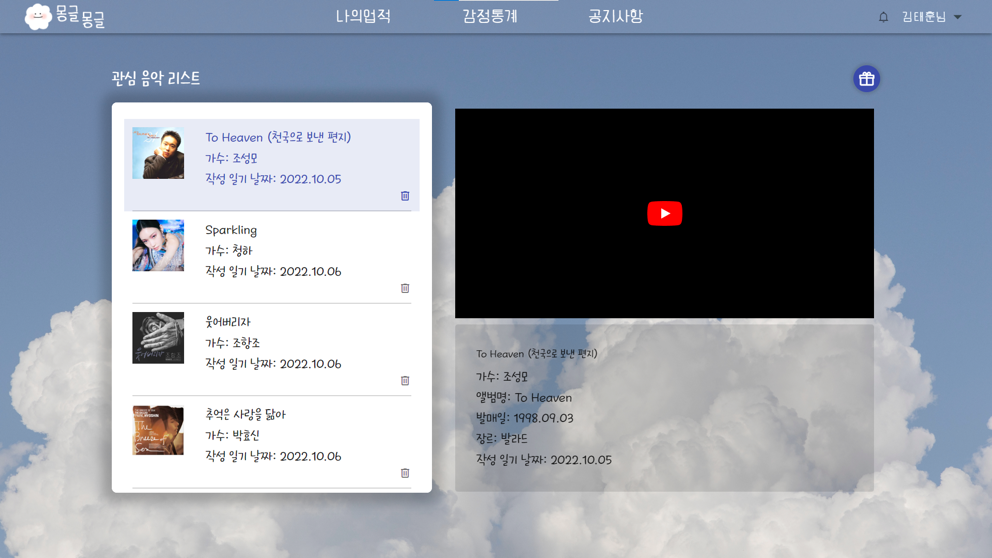

추천 받은 음악 리스트 확인

- 추천 받은 선물 리스트 확인

#### :heavy_check_mark: 통계 페이지

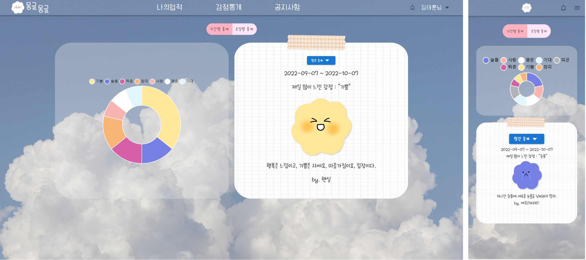

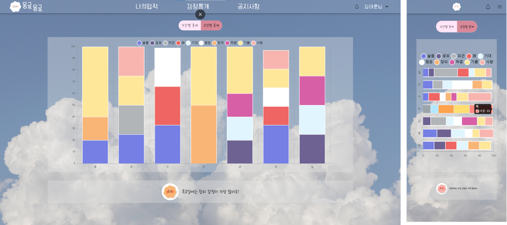

주간/월간/연간/기간별 다양한 통계를 확인

- 요일별 통계 확인

### :heavy_check_mark: 업적 페이지

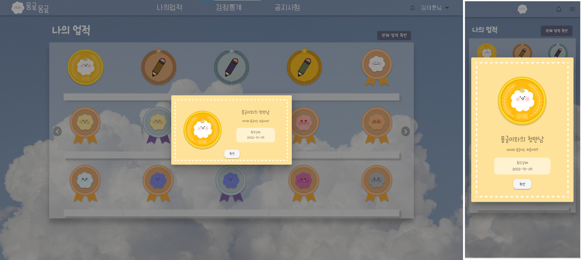

사용자의 이용을 유도하기 위한 업적 페이지

- 달성한 업적만 필터링 가능

- 업적 클릭 시 상세정보 확인 가능
